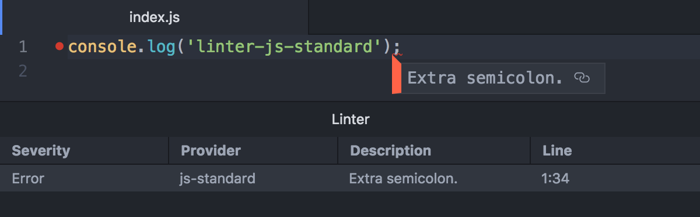

# linter-js-standard


[](https://standardjs.com)

> [Linter](https://github.com/steelbrain/linter) for [JavaScript Standard Style](https://standardjs.com) and its forks.



## Highlights

- Supports [JavaScript Standard style](https://standardjs.com) and [some of its forks](#default-style).
- Lints JavaScript within HTML and Markdown documents.
- Links to ESLint’s rule documentation.
- Runs globally, if desired.

## Installation

```console
$ apm install linter-js-standard
```

Alternatively, go to Settings → Install and search for `linter-js-standard`.

## Settings

### Default style

Default global style when none is installed locally. Choose between:

- [JavaScript Standard Style (`standard`)](https://standardjs.com)
- [JavaScript Semi-Standard Style (`semistandard`)](https://github.com/Flet/semistandard)
- [JavaScript Happiness Style (`happiness`)](https://github.com/JedWatson/happiness)

### Only lint if installed locally

Only lint if `standard` (or one of the [other styles](#default-style)) is installed as a dependency (that is, if it is listed in `devDependencies` or `dependencies` in `package.json`).

### Show ESLint rule ID

Show ESLint’s rule ID in the message description. For example: `Extra semicolon. (semi)`.

### Skip if ESLint is installed locally

Skip linting if ESLint is installed locally.

### Lint HTML documents

Lint JavaScript code within `<script>` tags in HTML documents.

### Lint Markdown documents

Lint JavaScript code blocks within Markdown documents.
